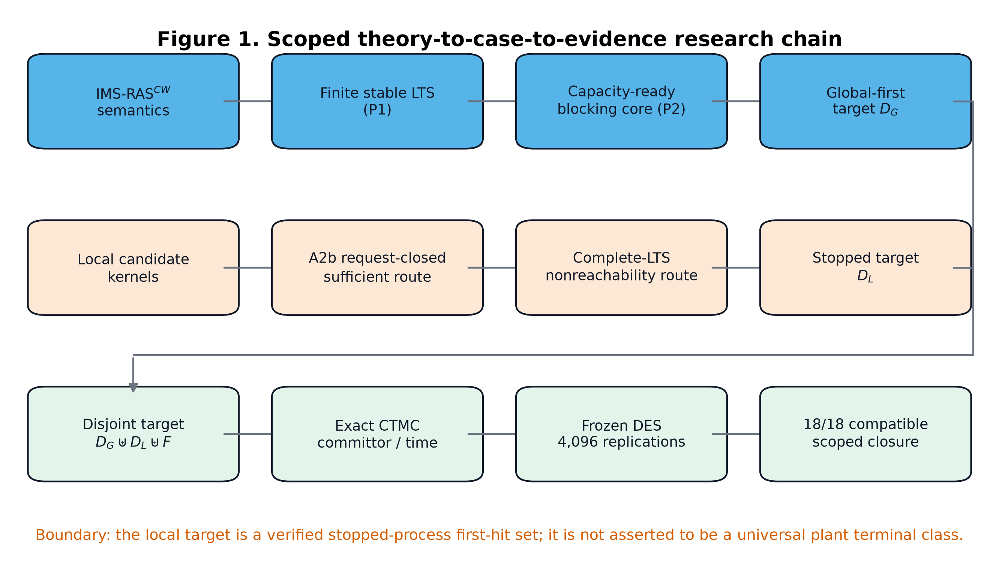
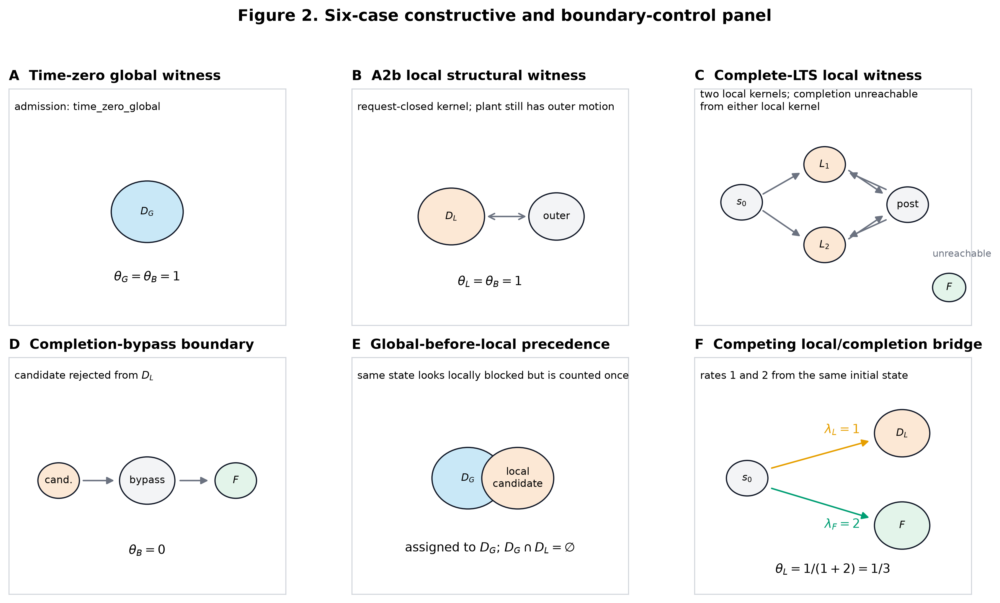
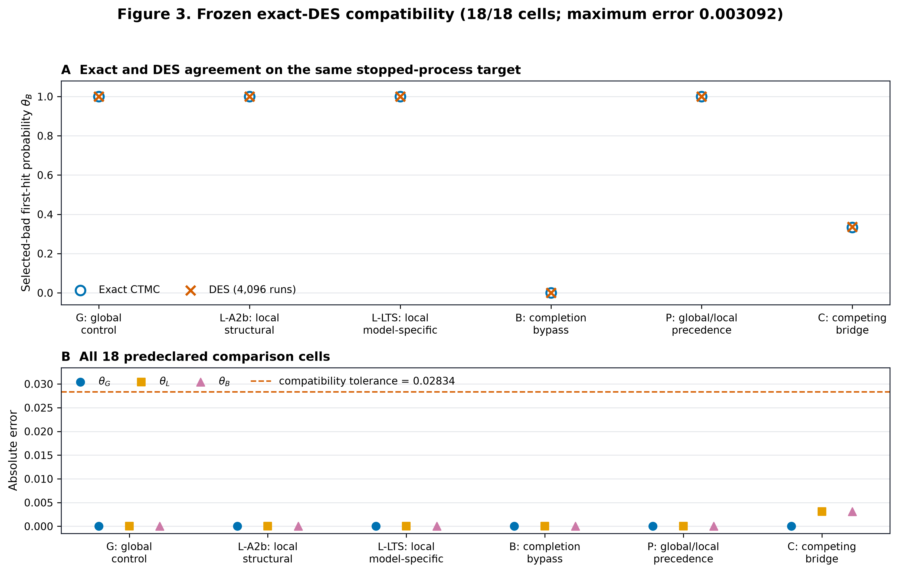
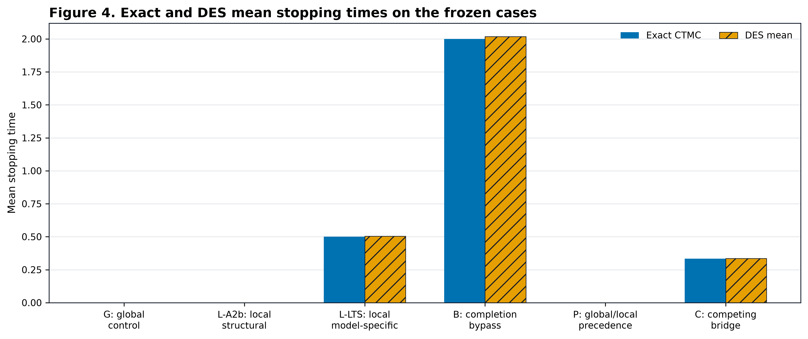

# 从容量感知 IMS 死锁证书到局部坏首达风险：建模、理论、案例与数值闭环

> 文档性质：中文完整科研链路稿／论文底稿，而非已完成同行评审的正式发表版本<br>
> 核心结论状态：`tier_a_dual_route_closure`（范围受限的构造性理论—案例闭环）<br>
> 原始 G6-B 八维重叠门状态：`OPEN_PENDING`，不得被本文的范围化闭环替代<br>
> 冻结证据根：`evidence/article_core/minimal_closure_v1/`<br>
> 证据清单自哈希：`1693342ac470b72f9b813edccb772f85751045940a243f7abc9241877cab0c77`

## 摘要

集成制造系统（integrated manufacturing systems, IMS）中的死锁并不只是简单的机器等待环。有限缓冲、加工后阻塞（blocking after service, BAS）、blocked-unload、自动导引车（AGV）、交接位与硬预约 token 会共同改变“资源何时仍被占有”“一个请求何时真正可执行”以及“局部阻塞是否已经不可恢复”。如果只在机器投影上寻找有向环，容易把存在剩余容量或完成旁路的状态误判为死锁；如果只以“全系统无后继”为坏事件，又会漏掉一个局部作业核已经不可完成、而核外作业仍能继续运动的不可逆失效。进一步地，若要计算死锁先于全批完成的概率，结构分类、停止规则、连续时间生成元和离散事件仿真必须使用同一坏目标，否则 exact 与 simulation 的数值比较没有明确的统计对象。

本项目建立了受限但严格的 `IMS-RAS^CW` 形式体系：以有限批、容量守恒、集合值零时闭包、OR-of-AND capacity-ready alternatives、BAS/blocked-unload 持有保持以及完整事件注册表为语义基础；在稳定状态 LTS 上，以“容量缺口—持有者—释放依赖”构造封闭阻塞核。项目内已证明：有限稳定 LTS 的 1-safe reachability-net 表示（P1）；覆盖封闭阻塞核与容量介导全局操作死锁的等价性（P2）；在 chain-decomposable 责任链条件下，覆盖全部关键资源的严格获取偏序排除该类死锁（P3）；有限竞争吸收 CTMC 的 committor、平均停止时间、敏感性和 Doob-\(h\) 条件过程方程（P4）；有限全观测显式 LTS 上最大许可 nonblocking 状态监督器的下降不动点（P5）；以及显式图多项式算法与紧凑模型 NP-hard/NP-complete 子类之间的表示敏感复杂性边界（P6）。

文章主线进一步把“局部死锁”精确定义为经过健全性准入的坏首达集合，而不是 plant LTS 的 terminal SCC。两条互补准入路线分别为：（i）在 A2b request-closed 子类中，由局部核结构证明核内作业不可完成；（ii）在一般有限 TransitionSpec 模型中，由完整、非截断 LTS 的 completion-nonreachability 审计给出模型特定证明。若候选状态保留到全批完成的旁路，则必须拒绝进入 \(D_{\mathrm{local}}\)。全局状态优先归入 \(D_{\mathrm{global}}\)，从而得到互斥停止分区 \(D_{\mathrm{global}}\uplus D_{\mathrm{local}}\uplus F\)。

冻结案例面板含六个案例：全局正例、A2b 局部正例、完整 LTS 多核正例、完成旁路反例、全局／局部优先级控制和一个局部失效与完成竞争的 (1:2) 桥接案例。每个案例执行 4096 次独立种子 Gillespie 路径仿真，并与同一停止目标上的精确 CTMC 结果比较。18 个预声明概率单元全部满足同时 Hoeffding 容差 (0.028340)，最大绝对误差为 (0.0030924479166667)。桥接案例的精确坏首达概率为 (1/3)，仿真得到 (1378/4096=0.33642578125)。这些结果关闭了“语义定义—理论准入—边界反例—精确概率—独立路径执行”的范围化闭环，但不构成生产级外部验证、普适死锁检测定理或原始 G6-B 全门通过。

**关键词：** 集成制造系统；资源分配系统；死锁；局部阻塞核；首次命中；连续时间马尔可夫链；离散事件仿真；监督控制；有限缓冲；AGV

## Abstract

This study develops a scoped theory-to-case closure for deadlock analysis in finite integrated manufacturing resource-allocation systems. The model retains finite capacities, blocking after service, blocked unloading, AGV and hard-reservation resources, set-valued zero-time closure, and OR-of-AND capacity-ready requests. Global operational deadlock is certified by a covering closed blocking core with explicit capacity-shortage, holder, and release-dependency evidence. Local failure is treated as a verified first-hit stopping event rather than a terminal strongly connected component of the plant. Two sound admission routes are used: a structural request-closed sufficient condition and complete finite-LTS completion-nonreachability for a specific enumerated model. A completion bypass is an explicit rejection witness, and global-before-local precedence keeps the stopping partition disjoint. Six frozen constructive and boundary cases are evaluated by exact CTMC calculations and 4,096-replication independent-seed DES. All 18 predeclared probability comparisons fall within the simultaneous tolerance; the maximum absolute error is 0.00309245. The result is a logically self-contained, scoped constructive closure. It is not a universal detector, an industrial validation, or a replacement for the still-open original G6-B gate.

**Keywords:** integrated manufacturing system; resource-allocation system; deadlock; local blocking core; first hitting; continuous-time Markov chain; discrete-event simulation

---

## 1. 引言

### 1.1 研究背景

制造系统死锁的本质是有限资源、路线依赖和释放时机共同形成的循环等待或更一般的封闭容量阻塞。经典 Petri 网研究已经系统讨论了柔性制造系统中的虹吸、死锁预防和结构控制 [2,4,6]；顺序资源分配系统研究则揭示了安全状态判定的计算困难 [3]；离散事件系统监督控制提供了在可控／不可控事件划分下构造安全、nonblocking 闭环行为的经典框架 [1]。这些工作给出了重要基础，但 IMS 场景仍有三个需要同时解决的建模问题。

第一，资源对象不再只有机器。输入／输出缓冲、AGV、路段、交接位和硬预约 token 都可能成为阻塞资源。加工结束也不必然释放机器：在 BAS 或 blocked-unload 语义下，工件在下一资源不可用时继续占有当前载体。由此，“机器等待图无环”并不足以推出系统无容量死锁，“发现一个有向环”也不足以推出系统已经死锁。

第二，全局静止与局部不可逆失效是不同对象。一个由两个作业构成的闭阻塞核可能已无法完成，但第三个核外作业仍能加工或运输。因此该状态不是 plant LTS 的 terminal SCC，也不是全局 operational deadlock；然而对于“是否已经发生不可恢复的局部失败”这一风险问题，它可以是合理的停止事件。若不区分 plant dynamics 与 stopped process，就会把“事件已发生”错误等同为“全系统完全静止”。

第三，结构理论和概率计算必须共享同一对象。Markov jump process 的 committor 描述先到某集合再到另一集合的概率 [5]，但它本身不决定 IMS 中哪个状态应属于坏集合。只有先证明或审计 \(D_{\mathrm{global}}\)、\(D_{\mathrm{local}}\) 与完成集合 \(F\) 的语义，才能构造有明确 estimand 的 CTMC；随后 exact solver 与 DES 还必须共享状态、边、速率和停止标签。

### 1.2 文献位置与研究缺口

本文不宣称重新发明 Petri 网死锁控制、circular wait 或一般监督控制。更准确的文献位置如下。

1. Petri 网文献说明了柔性制造死锁、虹吸控制和结构监控的重要性 [2,4,6]。本项目只在严格单位容量、一持一求、无 OR/AND、无隐藏释放的 `IMS-SIP^1` 子类上给出 state-induced wait-snapshot empty-siphon 桥；不声称一般 IMS 与 S3PR 同构。
2. 顺序资源分配系统的安全判定复杂性为 P6 的受限归约提供来源 [3]。本项目把该结果迁移到明确定义的 `IMS-SU^A` 子类，并同时给出显式 LTS 上不动点算法的多项式上界；不把紧凑输入与展开图复杂性混为一谈。
3. Ramadge–Wonham 框架是监督控制的基础 [1]。本项目 P5 只证明有限、全观测、state-based LTS 基准，不把它升级为部分观测或无限语言的一般结论。
4. Markov jump process 的 transition-path／committor 理论提供概率背景 [5]。本文的贡献在于先建立 IMS 停止目标、吸收域证书和同目标 exact/DES 执行契约，而不是把一般 TPT 直接当作 IMS 死锁定理。

因此，本文要填补的并非“所有方法都不能处理死锁”的宽泛空白，而是一个更窄且可验证的空白：**怎样在保留 IMS 容量与释放语义的有限模型中，把局部不可完成核定义成健全的坏首达事件，并通过正例、反例、精确概率和独立路径仿真实现逻辑闭环。**

### 1.3 研究问题

本文围绕五个研究问题展开：

- **RQ1：** 如何在有限缓冲、BAS、AGV 和硬预约共同存在时，用可独立核验的容量证据刻画全局操作死锁？
- **RQ2：** 局部阻塞状态在什么条件下可以被认定为“全批完成不可达”的坏首达事件，而不是暂时拥堵或可绕过阻塞？
- **RQ3：** 如何保证全局死锁、局部坏首达与全批完成构成互斥、可计算且概率上几乎必然到达的停止目标？
- **RQ4：** 精确 CTMC 与 DES 如何在同一 estimand 上形成可复核的数值闭环？
- **RQ5：** 当前闭环究竟支持什么结论，又明确不支持什么结论？

### 1.4 主要贡献

本文和项目已有成果合并后形成以下贡献链。

1. 提出受限 `IMS-RAS^CW` 语义，将机器、缓冲、AGV、交接资源和硬预约统一放入容量守恒框架，同时保留集合值零时闭包与 BAS 持有保持。
2. 以 OR-of-AND capacity-ready alternatives、容量缺口 witness、holder 解释和 release dependency 定义封闭阻塞核，并在受限子类中证明其覆盖形式与容量介导全局操作死锁等价。
3. 严格区分 plant-level predicate、terminal SCC 与 stopped-process target，提出两条有类型的局部准入路线：A2b 结构充分条件和完整 LTS completion-nonreachability 回退路线。
4. 构造互斥的 \(D_{\mathrm{global}}\uplus D_{\mathrm{local}}\uplus F\) 首达目标、概率 1 吸收域证书和 exact CTMC 方程，并规定 DES 使用同一 target hash、rate manifest 和冻结随机流。
5. 建立六案例的“正例—边界反例—优先级控制—非退化概率桥”面板，以 18/18 单元兼容和最大误差 (0.00309245) 完成范围化理论—案例闭环。
6. 保留 G5 失败、最小性失败、retired normalization 拒绝等负证据；本文结论被限定为构造性 article-core closure，不把历史失败后选择出的案例包装成 held-out confirmation。



**图 1  范围化理论—案例—证据链。** 上支路从 `IMS-RAS^CW` 稳定语义得到全局容量证书与 \(D_G\)；中支路对局部候选分别采用 A2b 或完整 LTS 准入，形成 stopped target \(D_L\)；二者与完成集合 \(F\) 汇合为互斥目标，再由 exact CTMC 与冻结 DES 交叉核验。图由 `scripts/build_article_figures.py` 从冻结 JSON 的结构契约生成；图中的流程框为理论关系，不表示计算耗时或案例规模。

---

## 2. 模型、符号与语义边界

### 2.1 有限批 IMS 资源分配模型

定义模型

\[
\mathcal I=(J,R,\operatorname{cap},\operatorname{route},
\operatorname{sem},Z,E_c,E_u,\Theta).
\]

其中：

- \(J\) 为有限批工件集合；
- \(R=M\cup B_{in}\cup B_{out}\cup A\cup V\cup R_{aux}\)，依次表示机器、输入／输出缓冲、运输／AGV 类资源、硬预约 token 与辅助资源；
- \(\operatorname{cap}:R\to\mathbb Z_+\) 给出整数容量；
- \(\operatorname{route}(j)\) 是工件 \(j\) 的有限阶段序列或有限分支图；
- \(\operatorname{sem}\) 声明 BAS、卸载、交接、运输、预约和释放规则；
- \(Z\) 为零时间事件集合；
- \(E_c,E_u\) 分别为可控和不可控非零时间事件；
- \(\Theta\) 保存容量、WIP、路线、速率和预约规则等参数。

本文排除设备故障／维修、抢占、动态插单、无限外生到达、未作 PH 展开的非指数 CTMC 时间，以及未进入形式模型的人工干预。排除项不是“不重要”，而是当前证明的适用域边界。

### 2.2 状态向量与容量 ontology

一个稳定前状态至少包含

\[
s=(\operatorname{stage}_s,\operatorname{hold}_s,
\operatorname{res}_s,\operatorname{pending}_s,
\operatorname{blocked}_s,\operatorname{choice}_s).
\]

对硬预约必须选择且只选择一种 ontology。

**Future-claim ontology：** 预约是同一物理容量的未来 claim，故

\[
\sum_j \operatorname{hold}_s(j,r)
+\sum_j \operatorname{hard\_res}_s(j,r)
\le \operatorname{cap}(r).
\]

**Token-resource ontology：** 预约 token 是独立资源 \(v\in V\)，分别满足

\[
\sum_j \operatorname{hold}_s(j,r)\le \operatorname{cap}(r),
\qquad
\sum_j \operatorname{res}_s(j,v)\le \operatorname{cap}(v),
\]

并另证 token 兑现不会令目标物理资源超容。物理资源与预约 token 不能双重记账；软预约的过售风险也不能伪装成物理容量。

定义资源可用量

\[
\operatorname{avail}_s(r)=\operatorname{cap}(r)-
\operatorname{occ}_s(r)-\operatorname{hard\_res}_s(r),
\]

其具体形式随所选 ontology 调整。

### 2.3 BAS 与 blocked-unload

加工／运输完成事件本身不必释放当前资源。若下一机器、缓冲、AGV、交接位或预约兑现不可用，工件进入 `blocked_complete` 或 `blocked_unload`，继续占有当前机器或载体，直到合法 `unload`、`handoff`、`leave` 或 `release` 真正发生。该语义是死锁证书的必要基础；若错误地在 service completion 时释放资源，可能人为消除真实阻塞核。

### 2.4 OR-of-AND capacity-ready alternatives

对稳定状态 \(s\) 和未完成工件 \(j\)，令

\[
\operatorname{Alt}_s(j)=\{a_1,\ldots,a_m\}
\]

为所有非容量前置条件已经满足的直接进展替代。一个替代 \(a\) 是需求向量

\[
\operatorname{need}_s(j,a,r)\in\mathbb N.
\]

替代内部为 AND：所需资源必须同时满足；替代之间为 OR：存在一个完全容量可行的替代即可进展，即

\[
\exists a\in\operatorname{Alt}_s(j),\quad
\forall r\in R:\quad
\operatorname{avail}_s(r)\ge\operatorname{need}_s(j,a,r).
\]

当前已使能且不需要新容量的 completion／release 作为空需求替代。这样，若一个证书声称“所有替代均被容量阻塞”，空需求替代会立即否证该证书，防止把仍可完成或释放的状态误判为死锁。

### 2.5 集合值零时闭包与稳定 LTS

非零时间事件 \(e\notin Z\) 触发到中间状态 \(u\) 后，必须立即执行零时闭包：

\[
\operatorname{Cl}(u)=
\{t\in S_{st}:u\leadsto_Z^*t,
\text{ 且 }t\text{ 无已使能零时事件}\}.
\]

闭包仅在终止且合流，或固定 tie-break 被明确写入语义时，才能简写为确定函数。一般情况下保留集合后继。闭包归一化 LTS 为

\[
\mathcal T_{\mathcal I}=(X,x_0,E,\to,F,D),
\]

其中若 \(\operatorname{fire}(x,e)=u\) 且 \(y\in\operatorname{Cl}(u)\)，则 \(x\xrightarrow e y\)。有限工件、有限路线、有限容量、有限 token 和有限事件模板保证状态空间有限。

### 2.6 P1：有限 LTS 与 reachability-net 表示

对每个可达稳定状态 \(x\in X\) 建 place \(p_x\)，对每条 LTS 边 \(b=(x,e,y)\) 建 transition \(t_b\)，令

\[
\operatorname{Pre}(p_x,t_b)=1,
\qquad
\operatorname{Post}(t_b,p_y)=1.
\]

初始只有 \(p_{x_0}\) 含一个 token。每次发射只把该 token 从一个状态 place 移到另一个状态 place，因此网是 1-safe 且有界；LTS 路径与可达单 token marking 双向对应。这证明任何有限稳定 LTS 都有这种 reachability-net 表示，但它是“一状态一 place”的行为表示，**不是**一般 IMS 到结构化 S3PR 的同构，也不是虹吸定理。

---

## 3. 容量介导死锁证书

### 3.1 状态依赖持有—请求证据图

在稳定状态 \(s\) 中建立二部证据图：工件节点表示未完成且持有或请求资源的工件，资源节点表示正容量资源；若工件持有／硬预约资源，建立 \(r\to j\) 边；若工件某个 capacity-ready 替代请求资源，建立 \(j\to r\) 边。每条边都必须携带工件、阶段、资源、数量和产生该关系的语义规则。blocked-unload 持续占有当前载体，不能因“加工已完成”而删除持有边。

### 3.2 容量缺口 witness

对 \(j,a,r\)，若

\[
\operatorname{need}_s(j,a,r)>
\operatorname{avail}_s(r),
\]

则 \(r\) 是替代 \(a\) 的容量缺口 witness。空需求替代没有 witness。

### 3.3 封闭阻塞核

定义

\[
K=(J_K,R_K,W_K,H_K),
\]

其中 \(W_K\) 记录三元组 \((j,a,r)\)，\(H_K\) 记录哪个核内 holder 以多少不可自主释放容量解释相应缺口。核必须同时满足：

1. \(J_K\ne\varnothing\)，且其中工件均未完成；
2. 对每个 \(j\in J_K\) 的每个 \(a\in\operatorname{Alt}_s(j)\)，至少存在一个 \(r\in R_K\) 构成容量缺口；
3. 每个缺口由核内实际持有或硬预约数量解释，不允许把同一容量重复计数为额外物理占用；
4. 用于解释缺口的容量在 holder 完成一个同样被核阻塞的进展前不可自主释放；
5. 至少存在一个真实 waiting／blocked 工件；
6. 局部核还要求所有对外进展依赖均由核内资源或 token claim 封闭。

若 \(J_K\) 覆盖全部未完成、非边界工件，则称核覆盖状态。极小性是集合包含极小，不等于最少工件、最小容量或唯一证书。

### 3.4 P2：覆盖核与全局操作死锁等价

在 `IMS-RAS^CW` 的容量介导子域中：

\[
s\text{ 是全局容量介导操作死锁}
\iff
s\text{ 存在覆盖封闭阻塞核}.
\]

**正向构造。** 若 \(s\) 无 admissible stable successor，则每个未完成工件的每个 capacity-ready alternative 必有容量缺口；否则原子获取规则会产生后继。由于已排除外部同步缺失、calendar-empty 边界和 policy stall，缺口容量由覆盖集合中的 holder／硬预约解释。若这些 holder 可无条件释放，则 release 本身就是一个可执行替代，与“无后继”矛盾。因此可构造 \(W_K,H_K\)。

**反向证明。** 若覆盖核存在，逐类检查 acquire、dispatch、reservation、transport choice、unload、handoff、release、timed completion 和 completion marking。需要资源的事件被至少一个 witness 阻断；无需新资源的已使能事件会形成空需求替代，与“每个替代都有 witness”矛盾；稳定状态没有剩余零时事件。因此不存在 admissible stable successor。核的真实阻塞者和覆盖性又排除全完成状态。

此等价只覆盖 capacity-mediated global operational deadlock。永久非资源 guard、未建模外部同步、人工停机、策略禁用以及无 holder/request/release 证据的 calendar-empty terminal block 必须另行分类。

### 3.5 环、SCC 与多容量边界

在所有关键资源单位容量、每个阻塞工件恰持有一个且请求一个资源、无替代、无 residual capacity、无隐藏释放的窄子类中，极小局部封闭核对应等待图 terminal SCC，并包含简单环。但对多容量、AND 请求、共享池化容量、硬预约或 AGV 交接系统，简单环既可能不充分，也可能遗漏更一般的 capacity knot。因此本文使用“全替代容量缺口 + holder + release dependency”而不是单一 cycle predicate。

### 3.6 P2c：严格子类中的 Petri siphon 桥

在 `IMS-SIP^1` 子类中，对每个核内资源 \(r\) 建空闲容量 place `free:r`；对每个工件 \(j\) 建诊断 transition \(t_j\)，其输入为请求资源 `free:q(j)`，输出为当前持有资源 `free:h(j)`。在单位容量且 residual 为 0 时，极小局部核资源集合对应极小 empty siphon，反向亦然。

该桥是**状态诱导 wait-snapshot 诊断网**，不等于 P1 的 reachability net，也不覆盖 OR／AND、多容量、软预约、隐藏 release 或非合流闭包。保留这些限定比把项目结果包装成“一般虹吸等价”更重要。

---

## 4. 理论性质：预防、概率、监督与复杂性

### 4.1 P3：严格资源获取偏序的充分性

令严格偏序 \(<\) 覆盖所有可能成为 blocked holder 或 witness 的机器、缓冲、AGV 和硬预约 token。若工件持有 \(r\) 后请求 \(r'\)，要求 \(r<r'\)。对于可分解为具体 holder 责任链的 covering core，从任意 witness 开始可连续选择

\[
r_1<r_2<r_3<\cdots.
\]

关键资源有限，序列必重复某资源，从而导出 \(r<r\)，与严格偏序反自反性矛盾。因此，若所有覆盖核均为 chain-decomposable 且遵循全局严格偏序，则不存在 P2 型容量介导全局死锁。

这只是充分条件；它不推出 nonblocking、livelock-free、policy-stall-free 或 almost-sure completion。若只对机器排序而遗漏缓冲、AGV 或预约 token，或聚合缺口无法分解到具体 holder chain，P3 不适用。

### 4.2 P3d/P3e：可达饱和阈值与成对修复

`BIX1-SAT` 在其声明的双向饱和族中证明：

\[
\text{全局容量死锁可达}
\iff n_A\ge c_M\ \text{且}\ n_B\ge c_G.
\]

该族的见证前缀从未成功 transfer，因此 \(D,V\) 保持空闲，阈值中 \(c_D,c_V\) 消失只对该族成立。

`BIX2-PERSIST` 把持久缓冲纳入三资源环。在 ring 模式 \(M\to D\to Q\to M\) 中：

\[
\text{全局容量死锁可达}
\iff
n_A\ge c_M,
n_B\ge c_D,
n_C\ge c_Q.
\]

删除 \(Q\to M\) 回流得到 DAG 模式后，该族不存在容量介导全局操作死锁，且从空初态存在串行完成路径。三资源环和删边思想本身是经典结构；项目贡献是把阈值、可达见证、release 语义和成对修复在同一个 IMS 事件模型中闭合，而不是声称发现新的 circular-wait 图论。

### 4.3 P4：有限竞争吸收 CTMC

P4 的详细推导将在第 6 节给出。其核心性质是：只有在所选坏／成功目标上的概率 1 吸收域已认证后，暂态生成元块才可逆，committor 与平均时间方程才有唯一有限解。可达但未选择的闭 SCC 会导致结构拒绝，而不是被静默丢弃。

### 4.4 P5：最大许可 nonblocking 状态监督器

对有限 LTS，令基础安全域 \(X_0=X\setminus D\)。对任意 \(Y\subseteq X\)，定义

\[
\operatorname{UPre}(Y)
=\{x\in Y:\text{所有不可控后继仍在 }Y\},
\]

\[
\operatorname{CoAcc}(Y)
=\{x\in Y:\text{存在完全留在 }Y\text{ 内到 }F\text{ 的有限路径}\},
\]

以及下降算子

\[
G(Y)=\operatorname{CoAcc}(\operatorname{UPre}(Y)).
\]

从 \(Y_0=X_0\) 迭代 \(Y_{k+1}=G(Y_k)\)，有限步到达不动点 \(Y^*\)。\(Y^*\) 对不可控事件闭合，每个保留状态到完成 coaccessible；允许所有后继仍在 \(Y^*\) 的可控事件，得到有限、全观测、state-based 域中的最大许可 nonblocking supervisor。若 \(x_0\notin Y^*\)，正确结果是初始不可行，而不是输出禁用全部事件的空策略。

### 4.5 P6：表示敏感复杂性

在无缓冲／AGV／预约／BAS、有限无环路线、单单位原子 acquire-release 的 `IMS-SU^A` 子类中，安全完成序列长度由剩余阶段数多项式界定；由 Lawley–Reveliotis 的 SU-SAFE 结果作结构保持归约 [3]，得到 `IMS-SU-SAFE` 为 NP-complete。

若 LTS 已显式展开，则 P5 每轮反向搜索和边扫描为 \(O(|X|+|E|)\)，至多删除 \(|X|\) 轮，因此保守时间上界为

\[
O\bigl(|X|(|X|+|E|)\bigr),
\]

空间为 \(O(|X|+|E|)\)。两者并不矛盾：前者以紧凑制造模型为输入，后者以可能已经指数膨胀的显式图为输入。当前项目没有对一般紧凑 `IMS-RAS^CW` 宣称未经证明的 PSPACE／EXPTIME 完备性。

---

## 5. 文章主线：局部不可完成作为坏首达事件

### 5.1 三类对象必须分开

本文区分以下三个本体层次。

1. **状态谓词：** 当前状态是否满足全局死锁或局部阻塞核条件。
2. **Plant 闭类：** 在完整 plant LTS 中是否属于无出边 SCC。
3. **停止标签：** 为回答特定 first-hit 问题而声明“到此停止跟踪”的集合。

局部坏状态可以有核外 outgoing plant arcs，因此通常不是 terminal SCC；但若已经证明核内作业沿任何后续 plant path 都不能完成，则“不可逆局部失败已发生”是一个合理停止事件。把这一事件设为吸收只改变 stopped process，不删除或否认原 plant arcs。

### 5.2 完成集合与全局坏集合

定义全批完成集合

\[
F=\{s:\text{所有工件完成，且无持有资源、无未满足请求}\}.
\]

定义 \(D_{\mathrm{global}}\) 为满足以下条件的稳定状态：未完成；没有 enabled transition；所有未完成工件均 blocked；存在覆盖全部未完成工件的 capacity-mediated closed blocking certificate；并排除 policy-only stall、非资源 guard 和未建模外部边界。

### 5.3 局部候选与 \(D_{\mathrm{local}}\)

先定义结构候选集合

\[
K_{\mathrm{local}}=
\{s\notin D_{\mathrm{global}}:
s\text{ 含至少一个 inclusion-minimal local closed core}\}.
\]

结构候选只证明“当前被封闭容量关系阻塞”，不自动证明将来不可完成。状态进入 \(D_{\mathrm{local}}\) 必须通过以下至少一条路线：

- **路线 A（A2b request-closed）：** 模型满足请求闭合语义，结构定理推出核内作业不可完成；
- **路线 B（complete-LTS nonreachability）：** 对同一模型、初始状态和完整 transition registry 生成的非截断有限 plant LTS，机器核验从候选状态到任何 \(F\) 均不可达。

若找到完成路径，输出最短 bypass 反例并拒绝候选。两条路线解决不同范围的问题：A2b 可迁移但假设更强；完整 LTS 接受更一般的转移语言，但结论只对已枚举模型成立。

### 5.4 A2b 请求闭合假设

一次 `TransitionSpec` 只能改变其所属工件的 mode、holds、requests 和 completion。对仍有未清请求的核内工件，任何改变这些字段的转移都必须消费当前 request alternatives 中至少一个可行 alternative；不允许存在与当前 request 脱钩、依赖核外资源／guard／中间 mode 的 completion bypass。同时要求：

- 无抢占、故障、外生释放或动态插单；
- transition registry 完整；
- 资源容量守恒，完成工件不再持有或请求资源；
- request alternatives 使用 OR-of-AND 语义；
- 只讨论 capacity-mediated blocking。

### 5.5 A2b 局部核不可完成定理

设 \(s\) 含局部封闭核 \(K=(J_K,R_K,W_K)\)。在 A2b 及上述假设下，从 \(s\) 出发任意 plant path 中，\(J_K\) 的作业均保持未完成，故 \(F\) 不可达。

**推导：**

1. 核内作业当前无 enabled transition；registry 完整保证这不是漏报事件。
2. 核外转移只改变其自身工件，不能直接完成或改写核内作业请求。
3. witness 容量由核内不可自主释放持有／硬预约解释；核外事件不能释放这些锁定单位。
4. 对每个核内工件的每个 alternative，至少一个 witness 的缺口持续存在。核外工件即使暂时占用或释放 residual，也不能把可用量提高到命中时刻以上。
5. A2b 排除与当前请求脱钩的旁路，因此其它资源的释放不能突然启用核内 completion／release。
6. 所以核内作业不能取得 capacity-ready alternative，也不能完成；全批完成要求它们全部完成，导出矛盾。

这里前向不变的是“核内作业未完成与命中请求不可满足”，不是证书 JSON 在每个后继状态字面不变。核外运动可能改变 state id、holder 列表、residual 或最短前缀，论文不应声称 certificate object invariant。

### 5.6 完整 LTS 路线

若不能静态证明 A2b，对每个候选 \(s\) 在完整 plant LTS 上执行图搜索：

\[
s\leadsto^*F\ ?
\]

- 若存在路径，保存最短事件序列并返回 `local_core_completion_reachable`；
- 若不存在路径，候选可作为该具体有限模型的 \(D_{\mathrm{local}}\)；
- 若 LTS 截断、分支不可用、registry 不完整或 provenance 不一致，结构化拒绝，不给出局部坏标签。

这种穷举证明不是一般结构定理，但它完全足以支撑“该枚举案例中的候选状态不可完成”这一模型特定结论。要求一种方法覆盖所有案例既没有必要，也会抹去方法各自的适用边界。

### 5.7 全局优先与互斥分区

状态分类按以下优先级执行：

1. 先标记 \(F\)；
2. 再标记 \(D_{\mathrm{global}}\)；
3. 仅在其余状态上提取和准入 \(D_{\mathrm{local}}\)；
4. 对剩余 plant graph 求真正的 `R_livelock`／`R_terminal` SCC。

因此

\[
D_{\mathrm{global}}\cap D_{\mathrm{local}}=\varnothing,
\qquad
(D_{\mathrm{global}}\cup D_{\mathrm{local}})\cap F=\varnothing.
\]

“全局优先”不是说局部结构不存在，而是同一 first-hit 结果只计数一次。

### 5.8 新旧 estimand 的关系

在同一底层过程上，令

\[
T_G=\inf\{t\ge0:X_t\in D_{\mathrm{global}}\},
\]

\[
T_B=\inf\{t\ge0:X_t\in
D_{\mathrm{global}}\cup D_{\mathrm{local}}\},
\]

\[
T_F=\inf\{t\ge0:X_t\in F\}.
\]

旧的全局 estimand 为

\[
\Theta_G=P(T_G<T_F),
\]

新的选择坏集 estimand 为

\[
\Theta_B=P(T_B<T_F).
\]

因为 \(D_{\mathrm{global}}\subseteq D_{\mathrm{global}}\cup D_{\mathrm{local}}\)，所以

\[
\Theta_G\le\Theta_B.
\]

这不是对旧 G5 指标“补算遗漏”，而是目标事件、停止规则 hash 和 estimand id 均改变的新问题。若使用相同客观状态分类，partition hash 可以保持不变；选择规则必须另有版本化身份。

---

## 6. 概率模型与解析推导

### 6.1 三路停止目标

令

\[
D_{\mathrm{sel}}=D_{\mathrm{global}}\cup D_{\mathrm{local}},
\qquad
A_{\mathrm{stop}}=D_{\mathrm{sel}}\cup F.
\]

在 stopped process 中，命中三类中任一类即停止。为避免与上一节旧／新 aggregate 记号混淆，数值结果使用分量记号：

\[
\theta_g=P(X_\tau\in D_{\mathrm{global}}),
\]

\[
\theta_\ell=P(X_\tau\in D_{\mathrm{local}}),
\]

\[
\theta_b=P(X_\tau\in D_{\mathrm{sel}})
=\theta_g+\theta_\ell,
\]

其中 \(\tau=\inf\{t:X_t\in A_{\mathrm{stop}}\}\)。机器字段分别为 `theta_global_before_success`、`theta_local_before_success` 和 `theta_selected_bad_before_success`。

### 6.2 速率生成元

只有非零时间事件为指数分布，或一般分布已显式作有限 phase-type 展开时，才构造 CTMC。对 \(i\ne j\)，令 \(q_{ij}\ge0\) 为稳定状态转移率，

\[
q_{ii}=-\sum_{j\ne i}q_{ij}.
\]

速率清单必须冻结并覆盖每条 plant arc；缺 rate、非正 rate、未知端点或手工 LTS 与 registry 重枚举不一致时，拒绝构造。

### 6.3 概率 1 吸收域

令 \(T=X_{\mathrm{stop}}\setminus A_{\mathrm{stop}}\)。仅仅存在一条到目标的 support path 并不保证几乎必然吸收。必须在完整正速率图中寻找完全位于 \(T\) 且没有出边到其它暂态状态或目标的未选择闭 SCC。令这些闭 SCC 的反向可达盆为 \(B_{\mathrm{closed}}\)，定义

\[
S_T=T\setminus B_{\mathrm{closed}}.
\]

在有限、完整、正速率 stopped CTMC 中：

\[
x\in S_T
\iff
P_x(\tau_{A_{\mathrm{stop}}}<\infty)=1.
\]

若声明全暂态域均可计算，则要求 \(B_{\mathrm{closed}}=\varnothing\)。反例是 \(s_0\to F\)、\(s_0\to c\)、\(c\to c\)：虽然 \(s_0\) 存在到 \(F\) 的路径，但以正概率进入未选择闭类 \(c\)，故不能报告原全域有限平均吸收时间。

### 6.4 Committor 方程

将目标类 \(C\in\{D_{\mathrm{global}},D_{\mathrm{local}},D_{\mathrm{sel}}\}\) 设为边界 1，其它选择目标设为边界 0。对 \(i\in S_T\)，首跳分解给出

\[
h_i^{(C)}=
\sum_{j\in S_T}\frac{q_{ij}}{\lambda_i}h_j^{(C)}
+\sum_{c\in C}\frac{q_{ic}}{\lambda_i},
\qquad
\lambda_i=-q_{ii}.
\]

整理得

\[
Q_{S_TS_T}h^{(C)}
=-Q_{S_TC}\mathbf1.
\]

由于 \(S_T\) 是概率 1 吸收域，\(Q_{S_TS_T}\) 是暂态子生成元并可逆，解唯一。三个分量还需数值检查

\[
h^{(D_{\mathrm{global}})}
+h^{(D_{\mathrm{local}})}
=h^{(D_{\mathrm{sel}})}.
\]

### 6.5 平均停止时间

对 \(m_i=E_i[\tau]\)，首跳等待时间均值为 \(1/\lambda_i\)，因此

\[
m_i=\frac1{\lambda_i}
+\sum_{j\in S_T}\frac{q_{ij}}{\lambda_i}m_j,
\]

即

\[
Q_{S_TS_T}m=-\mathbf1.
\]

若未选择闭类以正概率可达，则无条件吸收时间在相应路径上为 \(+\infty\)，当前协议必须拒绝有限 mean payload。坏命中条件时间也不能用无条件 \(m\) 冒充。

### 6.6 参数敏感性

若 \(Q(\eta)\) 可微，且在参数邻域内 \(S_T,D,F\) 分区不变，对 committor 方程微分得

\[
Q_{S_TS_T}\,\partial_\eta h
=-(\partial_\eta Q_{S_TS_T})h
-(\partial_\eta Q_{S_TD})\mathbf1.
\]

该式只在固定分区片段内成立；参数改变导致状态分类变化时，必须显式处理分段或重新认证分区。

### 6.7 Doob-\(h\) 条件过程

对 \(h_i>0\) 的状态，条件于先达坏集合的跳转率为

\[
q^h_{ij}=q_{ij}\frac{h_j}{h_i},\qquad i\ne j,
\]

并取对角元为非对角行和的负值。它描述“已知最终先达坏集合”时的高风险路径动力学，可用于解释或重要抽样设计；它不选择、不禁用原系统事件，因此不是控制器。

### 6.8 非退化桥接案例的闭式解

若初态 \(s_0\) 有两条竞争指数跳转：以速率 \(\lambda_L=1\) 进入 \(D_{\mathrm{local}}\)，以速率 \(\lambda_F=2\) 进入 \(F\)，则指数竞争性质给出

\[
\theta_\ell=\theta_b
=\frac{\lambda_L}{\lambda_L+\lambda_F}
=\frac13,
\qquad
\theta_g=0,
\]

\[
E[\tau]=\frac1{\lambda_L+\lambda_F}=\frac13.
\]

该解析恒等式为数值链提供一个不依赖大型求解器的锚点。

---

## 7. 计算流程、拒绝机制与复现协议

### 7.1 理论到计算的顺序

执行顺序被固定为：

1. 从模型、初态和完整 transition registry 重枚举 stable plant LTS；
2. 核对 state signatures、plant arcs、controllability 与 edge traces；
3. 标记 \(F\)，再提取全局证书并标记 \(D_{\mathrm{global}}\)；
4. 对其余状态枚举全部 inclusion-minimal local kernels；
5. 按 A2b 或完整 LTS 路线准入／拒绝 \(D_{\mathrm{local}}\)；
6. 对剩余图执行 SCC 分解并验证概率 1 吸收域；
7. 冻结 state-space、partition、stopping-rule、rate-manifest 与 estimand identities；
8. 求解 exact committor 和 mean stopping time；
9. DES 读取同一目标与速率，使用冻结独立种子路径执行；
10. 输出比较单元、残差、证书、拒绝码和 manifest。

### 7.2 必须结构化拒绝的情形

以下任一情形都不能通过“继续算一个数”掩盖：

- LTS 截断、存在不可用分支或零时闭包不完整；
- 容量、引用、stable／complete 一致性检查失败；
- 手工图与同一 registry 的确定性重枚举不一致；
- 缺失速率、非正速率或未知转移端点；
- bad 与 completion 标签重叠；
- 暂态无正 outgoing rate；
- 可达未选择闭 SCC 导致非几乎必然吸收；
- 局部候选存在到 \(F\) 的旁路；
- policy-only stall 被误当作 plant deadlock；
- 用全局证书替代局部证书，或只保留第一个而不是全部极小核。

### 7.3 随机流和同时容差

每个案例使用 \(n=4096\) 次路径仿真，master seed 为 `2026080601`。第 \(i\) 次 replication 的 seed 为

```text
integer(sha256("2026080601:i"))
```

并冻结整个 seed digest。对六案例 × 三 estimands 共 18 个比较，以 familywise Hoeffding 界预声明

\[
\epsilon
=\sqrt{\frac{\log(2\cdot18/0.05)}{2\cdot4096}}
<0.028340.
\]

结果产生后不因某个单元不理想而加样本、换 seed 或替换案例。DES 的作用是用独立路径机制检查同一停止目标的实现一致性，不是证明理论、证明 LTS 忠实性或证明外部可推广性。

### 7.4 可复现图形

本文四幅图由 `scripts/build_article_figures.py` 直接读取：

- `exact_results.json`；
- `des_results.json`；
- `article_case_certificates.json`；
- `article_closure_report.json`。

脚本不重新求解 exact、不重新运行 DES，也不改写证据；仅输出 300 DPI PNG 与矢量 PDF。`paper` 可选依赖只包含 Matplotlib。

---

## 8. 案例构建

### 8.1 案例设计原则

案例不是为了声称覆盖所有工厂，而是为每个逻辑环节提供最小、可反驳的见证。一个自洽面板至少需要：

- 结构正例：满足方法假设时应准入；
- 边界反例：违反关键假设时应拒绝；
- 分类控制：同一状态具备多种表象时不能重复计数；
- 概率桥：至少一个坏与成功均有正概率的非退化案例；
- 冻结执行：结果生成前锁定案例角色、estimand 和比较规则。

### 8.2 历史发现案例与理论硬化

项目早期 `C0–C5` 与 BIX 家族承担发现和反例生成角色：

| 案例／族 | 理论作用 | 保留下来的边界 |
| --- | --- | --- |
| C0 | 两资源最小死锁 | 用于证书与可达前缀基准 |
| C1 | 有等待环但 residual capacity 足够 | 否证“有环必死锁” |
| C2 | 严格顺序 DAG | 支撑偏序充分条件的正例 |
| C3 | 多实例资源 | 区分 cycle、knot 与 capacity core |
| C4 | 机器投影无死锁但运输／AGV 互锁 | 否证“只排机器即可” |
| C5 / C5_DAG | 双向制造岛、有限缓冲、blocked-unload 与成对删回流修复 | 说明释放语义和 paired repair 必须同模比较 |
| BIX1-SAT | 双向饱和可达阈值 | 只对无成功 transfer 前缀成立 |
| BIX2-PERSIST | 三资源持久缓冲环与 DAG 修复 | 关闭 persistent buffer 边界，不外推到一般网络 |

这些案例是 theory discovery／verification，不是独立 held-out confirmation。历史 G5 面板虽可复现，但冻结门结果包含 `4/3/2`、透明审计 `6/1/2` 和两个最小性失败，均被保留为负证据，不能通过选择后续有利案例改写。

### 8.3 文章核心六案例



**图 2  六案例构造与边界控制面板。** A–C 分别覆盖全局正例、A2b 局部路线和完整 LTS 局部路线；D 是完成旁路反例；E 验证全局优先避免重复计数；F 提供局部坏首达与完成竞争的非退化概率。该图为状态／逻辑示意，不按物理布局或时间尺度绘制。

#### 案例 A：全局三资源正例

初始稳定状态中：

- \(j_1\) 持有 \(r_a\)，请求 \(r_b\)；
- \(j_2\) 持有 \(r_b\)，请求 \(r_c\)；
- \(j_3\) 持有 \(r_c\)，请求 \(r_a\)。

三个资源均为单位容量，事件日历为空，所有作业 waiting。每个请求缺口由另一个核内 holder 解释，覆盖全部未完成工件，故初态属于 \(D_{\mathrm{global}}\)。停止时间为 0，精确结果 \((\theta_g,\theta_\ell,\theta_b)=(1,0,1)\)。

#### 案例 B：A2b 单局部核正例

\(j_1\) 与 \(j_2\) 分别持有 \(r_{\mathrm{local},a}\)、\(r_{\mathrm{local},b}\) 并请求对方资源；\(j_3\) 处于 `outer_ready`，有外部推进事件 `outer_tick`。因此系统仍有 plant motion，不是全局死锁；但 \(j_1,j_2\) 满足 request-closed，形成局部不可完成核。该状态准入 \(D_{\mathrm{local}}\)，得到 \((0,1,1)\)，停止时间为 0。这个案例直接展示“局部坏首达不要求整个 plant 静止”。

#### 案例 C：完整 LTS 多核正例

显式有限 LTS 含状态 `s_initial`、`dlocal_ab`、`dlocal_cd`、`post_hit`、`f_complete`。Plant 具有六条边：初态可进入两个不同局部核状态；每个局部状态可到 `post_hit`；`post_hit` 又可返回任一局部状态。完成状态在案例 schema 中存在，但从两个候选状态均不可达。完整图搜索因此准入两个 \(D_{\mathrm{local}}\) 状态。

Plant 有 6 条 arc，而 stopped graph 只有 4 条：命中局部状态后不再跟随其 outgoing arcs。这正是“stopping target 不是 terminal SCC”的机器见证。等速率初次进入两个局部状态的精确平均停止时间为 \(0.5\)，概率结果为 \((0,1,1)\)。

#### 案例 D：完成旁路反例

显式路径为

```text
s_local_candidate --t_bypass--> s_bypass --t_complete--> f_complete
```

因此当前局部表象不能推出 completion nonreachability。算法必须把候选排除于 \(D_{\mathrm{local}}\) 之外，结果为 \((0,0,0)\)，且全路径完成。若两条事件速率均为 1，精确 mean stopping time 为 2。

#### 案例 E：全局／局部重叠优先级控制

状态中 \(j_1:r_a\to r_b\)、\(j_2:r_b\to r_a\) 形成明显局部二环，\(j_3\) 持有 \(r_c\) 也请求 \(r_a\)。全部工件都 blocked 且无 enabled transition，所以覆盖全体的全局证书成立。分类器先归入 \(D_{\mathrm{global}}\)，不再同时计为 \(D_{\mathrm{local}}\)，得到 \((1,0,1)\)。

#### 案例 F：局部／完成竞争桥

```text
s0 --enter_local, rate 1--> d_local
s0 --complete,    rate 2--> f_complete
```

`d_local` 具有 A2b proof flag，且完整两出口 LTS 也显示其到 \(F\) 不可达。解析结果为 \((0,1/3,1/3)\)，mean time 为 \(1/3\)。该案例故意保持最小，以隔离 estimand 和停止语义；它不是生产设施数字孪生。

### 8.4 六案例的准入与证书摘要

| 案例 | 角色 | 准入路线／控制 | Plant arcs | Stopped arcs | 核心断言 |
| --- | --- | --- | ---: | ---: | --- |
| 全局三资源 | 构造正例 | time-zero global | 0 | 0 | 覆盖全局核 |
| A2b 单局部核 | 构造正例 | A2b request-closed | 0 | 0 | 核内作业不可完成 |
| 完整 LTS 多核 | 构造正例 | complete-LTS nonreachability | 6 | 4 | 两候选均到不了 \(F\) |
| 完成旁路 | 负控制 | not admitted | 2 | 2 | 候选可到 \(F\) |
| 全局／局部重叠 | 负控制 | global precedence | 0 | 0 | 只计 \(D_G\) |
| 竞争桥 | 非退化概率 | A2b + complete two-exit LTS | 2 | 2 | 精确 \(1/3\) |

---

## 9. 数值结果

### 9.1 理论义务结果

六案例的证书报告显示：

- 所有案例都通过正有限速率、目标互斥、全局优先、stopped／plant 分离和 selected absorption almost-sure 检查；
- A2b 正例和竞争桥均带有 request-closed proof；
- 多核案例使用完整 LTS 路线，`dlocal_ab` 与 `dlocal_cd` 到完成集合均不可达；
- 完成旁路案例明确记录 `s_local_candidate` 到 \(F\) 可达，因此未准入；
- 全局／局部重叠案例虽然存在局部候选结构，但只进入 \(D_{\mathrm{global}}\)；
- exact committor 的三个残差字段在六案例中均为 0。

这组结果先关闭了“分类是否按理论发生”的离散义务，再进入概率比较；数值相近不能反过来代替这些结构证明。

### 9.2 概率结果

| 案例 | Exact \((\theta_g,\theta_\ell,\theta_b)\) | DES \((\theta_g,\theta_\ell,\theta_b)\) | DES 计数 \((D_G,D_L,F)\) | 最大概率误差 |
| --- | --- | --- | --- | ---: |
| 全局三资源 | \((1,0,1)\) | \((1,0,1)\) | \((4096,0,0)\) | 0 |
| A2b 单局部核 | \((0,1,1)\) | \((0,1,1)\) | \((0,4096,0)\) | 0 |
| 完整 LTS 多核 | \((0,1,1)\) | \((0,1,1)\) | \((0,4096,0)\) | 0 |
| 完成旁路 | \((0,0,0)\) | \((0,0,0)\) | \((0,0,4096)\) | 0 |
| 全局／局部重叠 | \((1,0,1)\) | \((1,0,1)\) | \((4096,0,0)\) | 0 |
| 竞争桥 | \((0,0.3333333333,0.3333333333)\) | \((0,0.33642578125,0.33642578125)\) | \((0,1378,2718)\) | 0.0030924479 |



**图 3  冻结 exact–DES 概率兼容性。** 上图比较六案例的选择坏首达概率 \(\theta_b\)；下图显示 \(6\times3=18\) 个预声明单元的绝对误差与同时容差。所有单元均在 \(0.028340\) 下方，最大误差只出现在竞争桥的 \(\theta_\ell\) 和 \(\theta_b\)。

18/18 单元全部 compatible。唯一非零概率差为

\[
\left|\frac{1378}{4096}-\frac13\right|
=0.0030924479166667,
\]

约为同时容差的 \(10.91\%\)。确定性时间零分类案例和必经完成旁路案例的概率误差为 0，并不意味着 DES “总能精确”；这些案例本来只有一个停止类别可达。真正检验随机分流的是竞争桥。

### 9.3 平均停止时间

| 案例 | Exact mean | DES mean | 绝对差 |
| --- | ---: | ---: | ---: |
| 全局三资源 | 0 | 0 | 0 |
| A2b 单局部核 | 0 | 0 | 0 |
| 完整 LTS 多核 | 0.5 | 0.5035233533 | 0.0035233533 |
| 完成旁路 | 2 | 2.0179046384 | 0.0179046384 |
| 全局／局部重叠 | 0 | 0 | 0 |
| 竞争桥 | 0.3333333333 | 0.3356822355 | 0.0023489022 |



**图 4  冻结案例的 exact 与 DES 平均停止时间。** 时间零案例在初态已命中目标；多核案例的第一次等速率局部命中均值为 \(1/2\)；旁路需经历两个单位率阶段，均值为 2；竞争桥总离开率为 3，均值为 \(1/3\)。本文没有为 mean time 预声明与概率相同的同时统计门，因此该图只作为机制一致性描述，不新增“均值统计通过”声明。

### 9.4 Claim tier 与原始门的关系

冻结报告选择

```text
tier_a_dual_route_closure
```

其含义是：两条局部准入路线、两个边界控制和同目标非退化概率桥均得到匹配证据，足以支撑本文的范围化主命题。它**不**表示：

- 原始 13 案例 G6-B 已全部执行；
- 原始八维 overlap gate 已通过；
- 历史案例已转化为 held-out evidence；
- 任何真实工厂都已被外部验证；
- 一致性可以推广到未枚举模型。

原始 G6-B 状态继续为 `OPEN_PENDING`。

---

## 10. 分析与讨论

### 10.1 理论与案例是否已经闭环

对本文声明的窄问题，答案是“已经形成闭环”。闭环的每一环都有对应证据：

| 逻辑环节 | 理论命题 | 正向证据 | 反向／边界证据 | 数值证据 |
| --- | --- | --- | --- | --- |
| 全局死锁 | 覆盖封闭核等价 P2 | 三资源全局正例 | residual／投影反例保存在历史案例 | time-zero \(\theta_g=1\) |
| 局部结构准入 | A2b 核内不可完成 | 单局部核 + 外部运动 | request-independent bypass 理论反例 | time-zero \(\theta_\ell=1\) |
| 模型特定准入 | complete-LTS nonreachability | 多核显式 LTS | completion bypass | \(\theta_\ell=1\) vs 0 |
| 分区互斥 | global-before-local | 全局／局部重叠控制 | 重复计数被禁止 | \((1,0,1)\) |
| 概率语义 | 三路 stopped CTMC | \(1:2\) 竞争桥 | 未选择闭类触发拒绝 | exact \(1/3\)，DES 0.33643 |
| 实现一致性 | 同一 target/rate | 18 个比较单元 | 不允许 post-hoc rerun | 18/18 compatible |

因此本文不需要一个“覆盖所有案例的单一万能方法”才能自洽。A2b 与 complete-LTS 是有明确类型的两条证明路线；方法不适用时的正确输出是换用另一条已声明路线或拒绝，而不是强行给出相同结论。

### 10.2 为什么局部坏首达不是范畴错误

一个事件是否适合作为停止目标，取决于研究问题。如果问题是“全系统何时彻底无动作”，只能使用全局死锁／terminal class；如果问题是“是否已经首次发生一组作业不可恢复地无法完成”，那么经健全性证明的局部核命中就是事件本身。命中之后核外作业继续运动，并不改变“该事件已经发生”的事实。
这类似 competing-risk 建模中的事件吸收：吸收是分析过程的终止规则，不要求物理世界停止。关键约束是不可把暂时局部阻塞随意吸收；本文通过 A2b 或 complete-LTS 证明来守住这一边界。

### 10.3 为什么完成旁路是核心而不是附属案例

若没有旁路反例，方法很容易退化为“看到局部等待环就计坏”。完成旁路明确展示：

```text
current local-looking blockage
    does not imply
future completion nonreachability
```

因此局部候选与局部坏集合被分成两个对象。这个负控制使主命题可被证伪，也解释了为什么一般 TransitionSpec 需要完整 LTS 回退路线。

### 10.4 Exact–DES 一致能说明什么

Exact 与 DES 共享模型、速率和停止标签，但概率机制不同：前者求解线性方程，后者抽样连续时间路径。它们的一致支持：

- target partition 被一致翻译到 solver 和 simulator；
- rate manifest 与停止条件在两个执行器间未发生显著错配；
- 桥接案例的解析 \(1/3\) 被两类执行机制复现。

它们不能说明：

- A2b 定理已由仿真证明；
- plant LTS 一定忠实于真实设备；
- 4096 次样本足以处理稀有事件；
- 六案例可以代表全部制造系统；
- DES 与 exact 是统计独立的外部确认研究。

### 10.5 小案例是否足以形成论文逻辑

用于证明语义与边界的构造案例可以很小。桥接案例的任务是隔离 first-hit estimand，而不是模拟工厂规模；旁路案例的任务是给出最短反例，而不是展示产线 KPI。只要文章不把这些案例包装成工业有效性证据，小案例可以使逻辑更透明。

但“小案例足以逻辑闭环”不等于“小案例足以冲击任何顶刊”。理论／方法稿仍需要与近年方法对比、规模性展示和更有代表性的制造语境，这一投稿差距在另一份项目评估文档中单独讨论。

### 10.6 项目主链与本文主链的关系

项目总体成果比本文更宽，包括 P1–P6、Petri 严格子类桥、BIX 阈值族、监督器和复杂性边界。本文最强、最完整的当前论文主线则是：

```text
IMS-RAS^CW semantic boundary
  -> capacity-aware global certificate
  -> typed local admission
  -> disjoint first-hit target
  -> certified finite CTMC
  -> exact/DES same-target closure
```

把所有项目定理都塞成同等主贡献会稀释文章；更合适的写法是用 P1–P3 提供结构基础，以 P4 支撑概率推导，把 P5–P6 作为更广项目贡献和后续控制扩展。

---

## 11. 局限、有效性威胁与不可升级声明

### 11.1 理论局限

1. A2b 是充分条件而非必要条件；违反 A2b 的模型可能仍安全，也可能通过其它不变式证明局部不可完成。
2. complete-LTS 路线只对完整、非截断、事件注册表完备的有限模型有效；状态爆炸限制其规模。
3. P2 只刻画 capacity-mediated global operational deadlock，不覆盖永久非资源 guard、外部同步缺失或人工停机。
4. P3 需要覆盖全部关键资源的严格偏序与 chain-decomposable 责任链；聚合多容量缺口一般不在其已证范围。
5. Petri bridge 只对 `IMS-SIP^1` 的单位容量、一持一求状态快照成立，不是一般 S3PR 结构等价。
6. 一般紧凑 `IMS-RAS^CW` 的精确复杂性分类仍未关闭。

### 11.2 概率局限

1. CTMC 要求指数时间或显式 PH 展开；一般非指数加工时间不能直接代入。
2. 未选择闭类会破坏全域概率 1 吸收，当前协议拒绝部分域定量输出。
3. 速率敏感性只在分区固定区间成立。
4. Doob-\(h\) 只解释条件路径，不是风险控制策略。
5. 当前样本规模和方法未针对极小概率事件优化，没有 rare-event efficiency 结论。

### 11.3 案例与外部有效性局限

1. 五个复用案例属于 sealed discovery／boundary evidence，不是独立 held-out confirmation。
2. 竞争桥故意极简，不能代表生产级多设备、多产品、多运输单元。
3. 没有真实工厂日志、数字孪生校准、专家标注或部署结果。
4. 尚未报告 throughput、tardiness、WIP、恢复成本、控制代价或 Pareto 权衡。
5. 尚未与近期 Petri 网、MILP／SAT、启发式死锁控制或其它 stochastic risk 方法做统一 benchmark。

### 11.4 冻结负证据

历史 G5 的不通过、两个最小性失败、G6-R 的 R1/R2 失败、R3 historical-only，以及 retired normalization 中 119 个 eligible 对象／62 个 typed refusals 均保留。特别是 retired evidence 没有可用于“独立确认”声明的 random-stream 或 metric-schema overlap。负证据的存在不会否定当前范围化文章，但禁止把结论升级成普适或 held-out 验证。
---

## 12. 复现、数据可用性与证据边界

### 12.1 冻结身份

- Article scope lock：`cases/article_core/article_scope_lock_v1.json`<br>
  self SHA-256：`86ec7b80c888c7758d326a9de7793b0f0f65f4740ecf0303e1b17d2d14344660`
- Evidence root：`evidence/article_core/minimal_closure_v1/`
- Manifest self SHA-256：`1693342ac470b72f9b813edccb772f85751045940a243f7abc9241877cab0c77`
- Claim tier：`tier_a_dual_route_closure`
- Original gate：`OPEN_PENDING`

### 12.2 核心文件映射

| 论文内容 | 权威项目文件 |
| --- | --- |
| 模型与 P1–P6 | `docs/theory/CORE_THEOREMS_AND_PROOFS.md` |
| 局部首达定理 | `docs/theory/G6_LOCAL_FIRST_HIT_AND_STOPPING_THEOREMS.md` |
| 概率层 | `docs/theory/PROBABILITY_LAYER.md` |
| 原英文范围稿 | `docs/paper/IMS_LOCAL_FIRST_HIT_THEORY_AND_CASES.md` |
| Claim–evidence 映射 | `docs/paper/ARTICLE_CLAIM_EVIDENCE_MATRIX.md` |
| 案例证书 | `evidence/article_core/minimal_closure_v1/article_case_certificates.json` |
| Exact 结果 | `evidence/article_core/minimal_closure_v1/exact_results.json` |
| DES 结果 | `evidence/article_core/minimal_closure_v1/des_results.json` |
| Closure report | `evidence/article_core/minimal_closure_v1/article_closure_report.json` |
| 可复现作图 | `scripts/build_article_figures.py` |

### 12.3 作图命令

安装论文可选依赖后，在仓库根目录执行：

```bash
python -m pip install -e ".[paper]"
python scripts/build_article_figures.py
```

该命令只读取冻结 evidence 并生成 `docs/paper/figures/` 下的 PNG／PDF，不运行科研实验。冻结 evidence 不得原地重生成或覆盖。

### 12.4 研究伦理与投稿元数据

本研究当前不涉及人类受试者、动物实验或个人数据。正式投稿前仍需由作者补齐作者顺序、单位、基金、利益冲突、软件／数据公开范围和生成式 AI 使用披露；本稿不替作者虚构这些元数据。

---

## 13. 结论

本项目已经把一个容易混淆的问题转化为可证明、可拒绝、可计算的研究链：全局死锁由覆盖容量核认证；局部结构只有在 A2b 请求闭合或完整 LTS completion-nonreachability 成立时，才成为坏首达集合；全局优先保证分区互斥；概率 1 吸收域保证 CTMC 方程有定义；exact 与 DES 在同一停止目标上交叉执行。

六案例面板为两条准入路线各提供正例，为关键边界提供完成旁路和重复计数反例，并用 \(1/3\) 竞争桥把结构语义连接到概率结果。18/18 概率单元在冻结容差内，最大误差 \(0.00309245\)。因此，**“有类型的局部准入 + 互斥 first-hit 目标 + 同目标 exact/DES”已经形成一篇逻辑自洽的范围化理论／方法文章主链。**

同时，结论必须停在正确位置：它不是万能死锁检测器，不是一般 S3PR 等价，不是工业验证，也不关闭原始 G6-B。下一阶段若以投稿为目标，应增加系统化文献对比、规模与现实性更高的案例、方法基线和制造 KPI，而不需要推翻当前已经闭合的理论核心。

---

## 参考文献

[1] P. J. Ramadge and W. M. Wonham, “Supervisory control of a class of discrete event processes,” *SIAM Journal on Control and Optimization*, 25(1), 206–230, 1987. [https://doi.org/10.1137/0325013](https://doi.org/10.1137/0325013)

[2] J. Ezpeleta, J. M. Colom, and J. Martínez, “A Petri net based deadlock prevention policy for flexible manufacturing systems,” *IEEE Transactions on Robotics and Automation*, 11(2), 173–184, 1995. [https://doi.org/10.1109/70.370500](https://doi.org/10.1109/70.370500)

[3] M. A. Lawley and S. A. Reveliotis, “Deadlock avoidance for sequential resource allocation systems: Hard and easy cases,” *International Journal of Flexible Manufacturing Systems*, 13(4), 385–404, 2001. [https://doi.org/10.1023/A:1012203214611](https://doi.org/10.1023/A:1012203214611)

[4] M. P. Fanti and M. Zhou, “Deadlock control methods in automated manufacturing systems,” *IEEE Transactions on Systems, Man, and Cybernetics—Part A*, 34(1), 5–22, 2004. [https://doi.org/10.1109/TSMCA.2003.820590](https://doi.org/10.1109/TSMCA.2003.820590)

[5] P. Metzner, C. Schütte, and E. Vanden-Eijnden, “Transition path theory for Markov jump processes,” *Multiscale Modeling & Simulation*, 7(3), 1192–1219, 2009. [https://doi.org/10.1137/070699500](https://doi.org/10.1137/070699500)

[6] Z. W. Li, N. Q. Wu, and M. C. Zhou, “Deadlock control of automated manufacturing systems based on Petri nets—A literature review,” *IEEE Transactions on Systems, Man, and Cybernetics—Part C*, 42(4), 437–462, 2012. [https://doi.org/10.1109/TSMCC.2011.2160626](https://doi.org/10.1109/TSMCC.2011.2160626)

[7] Y. Hou and K. Barkaoui, “Deadlock analysis and control based on Petri nets: A siphon approach review,” *Advances in Mechanical Engineering*, 9(3), 2017. [https://doi.org/10.1177/1687814017693542](https://doi.org/10.1177/1687814017693542)
